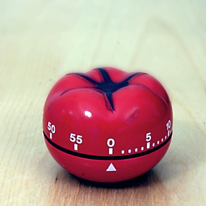
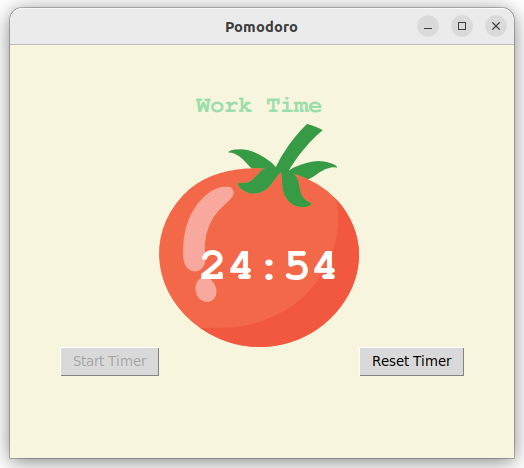

## Pomodoro Timer

Tkinter version **Pomodoro Timer**    
       
The [Pomodoro Technique](https://en.wikipedia.org/wiki/Pomodoro_Technique) is a time management method developed by Francesco Cirillo in the late 1980s        

       


###### It's a part of the **#100DaysOfCode** challenge by *Angela Yu*. ######    


#### Prerequisites
You will need the following software to run the Pomodoro Timer:
 - [Python 3](https://www.python.org/downloads/)
 - [playsound](https://pypi.org/project/playsound/)

#### Installation
To get started with the **Pomodoro Timer**, follow these steps:

1. **Install** playsound
```sh
pip install playsound
```

2. **Clone** the repository:

```sh
git clone https://github.com/resole79/pomodoro_timer.git
```

3. **Run** the **main.py** file:

```sh
python main.py
```

#### File Structure   
 - **main.py**: Main program.

 

       


## **Credit**

Author : Emilio Reforgiato (resole79)

##
<p align="right"><a href="https://www.linkedin.com/in/emilio-reforgiato/" target=”_blank” ></a></p>


